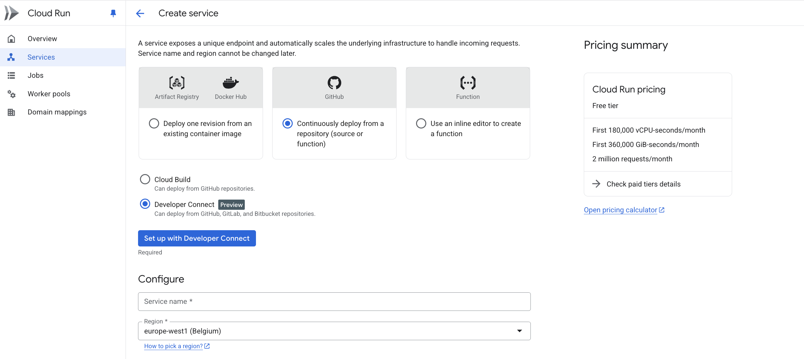

# Module 10: Deploying Flask Apps with GCP Cloud Run

## Overview

This guide walks you through deploying a Dockerized Flask application to Google Cloud Platform's Cloud Run service with continuous deployment from GitHub.

---

## Step 1: Set Up Your Repository

Start by creating your own copy of the base repository:

**Base Repo:** [https://github.com/hantswilliams/dokploy-docker-flask](https://github.com/hantswilliams/dokploy-docker-flask)

> **Important:** You must create your own version of this repo. If you try to clone the original, you won't have permission to push changes. You have two options:
> - **Option A:** Fork the repository to your GitHub account
> - **Option B:** Manually copy the files into a new repository you create

---

## Step 2: Create a Cloud Run Service

### 2.1 Start the Service Creation

1. Navigate to **Cloud Run** in the GCP Console
2. Click **Create Service**
3. Click the **Connect Repo** button (with the GitHub logo)

### 2.2 Configure Repository Connection

Select **"Continuously deploy from a repository (source or function)"** as shown below:

### 2.3 Set Up Developer Connect

1. Select **Developer Connect** — this will walk you through granting GCP permission to access your GitHub repos
2. After completing the Developer Connect setup and confirming you can see your GitHub repos, **stop and restart from Step 2.1**

   > **Note:** There can be a slight delay between the GitHub connection and GCP recognizing it. Restarting the process helps ensure everything is properly synced.

3. Click the blue **"Set up with Developer Connect"** button to select the repo containing your Dockerfile

### 2.4 Configure Service Settings

| Setting | Value |
|---------|-------|
| **Service name** | Any name you prefer |
| **Region** | Choose one you have access to |
| **Authentication** | Allow unauthenticated invocations (public access) |
| **Billing** | Request-based |

### 2.5 Configure Autoscaling & Container

| Setting | Value |
|---------|-------|
| **Maximum instances** | 1 (to limit costs from bots) |
| **Container port** | Match the port set in your Dockerfile |
| **Revision scaling maximum** | 1 |

Leave all other container settings at their defaults.

---

## Deployment Complete

Once configured, Cloud Run will automatically build and deploy your application whenever you push changes to your connected GitHub repository.
